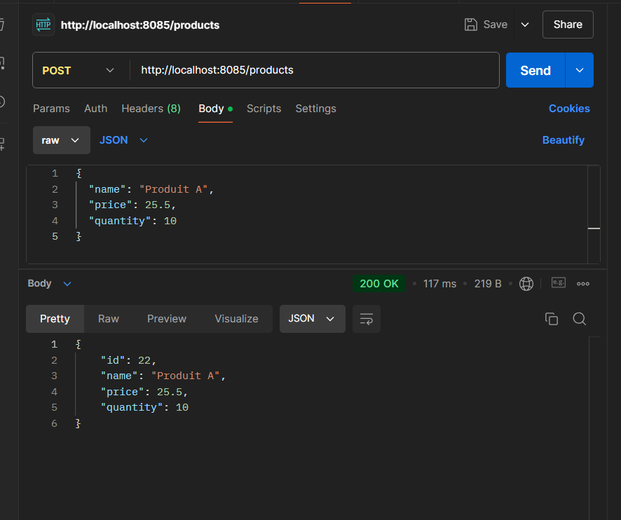
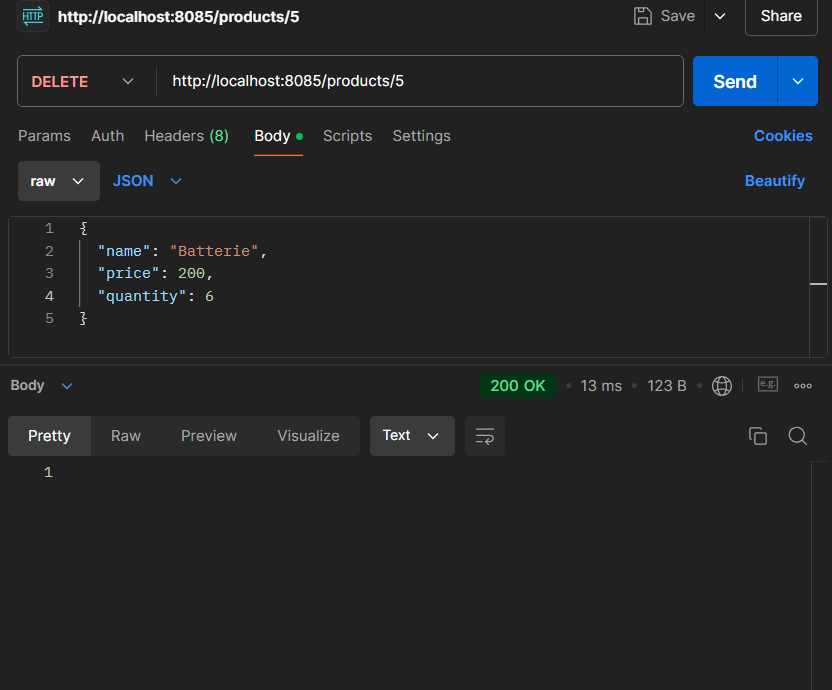
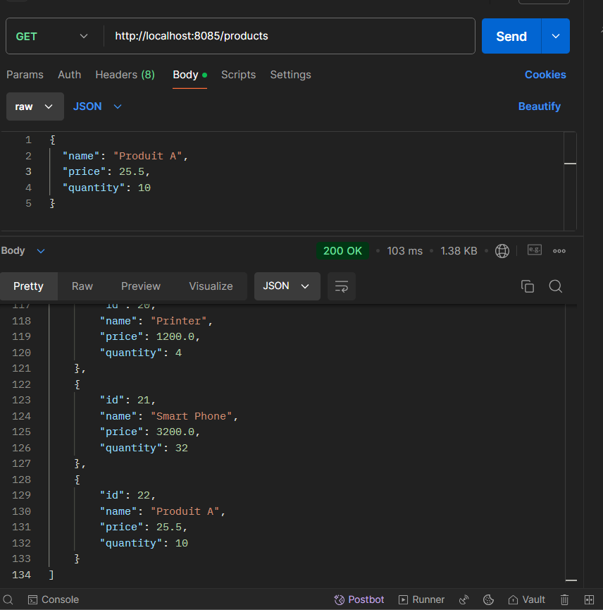
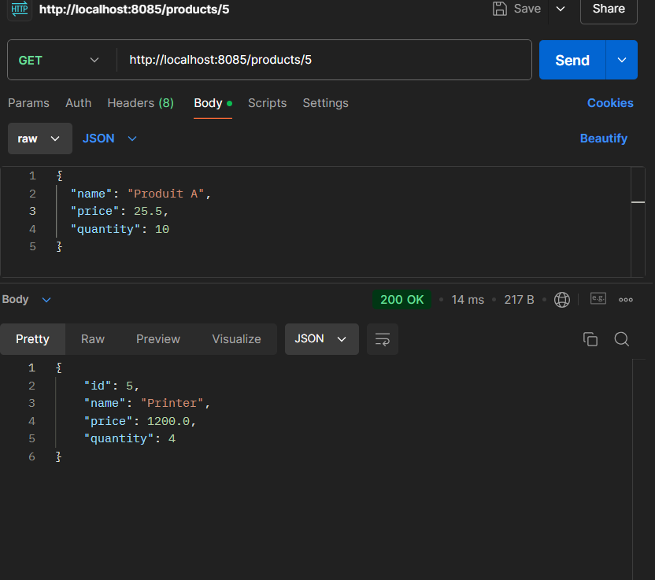
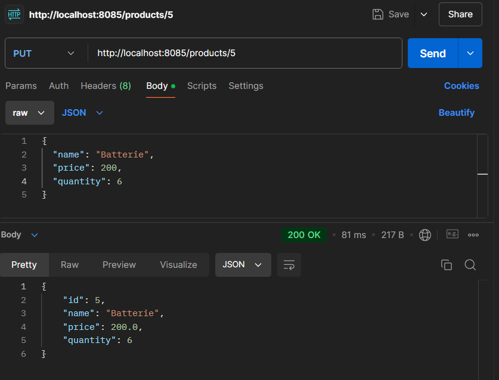

<h1>Gestion des produits</h1>

ce projet programmes pour realiser les fonctions CRUD 

les tests sont fait sur Postman 

<h3>ajout d'un produit</h3>

<h3>Supprimer un produit</h3>

<h3>Affichage des produits</h3>

<h3>afficher chaque produit par Id</h3>

<h3>ajouter des produits dans sql</h3>

<h3>mise à jour d'un produit </h3>
